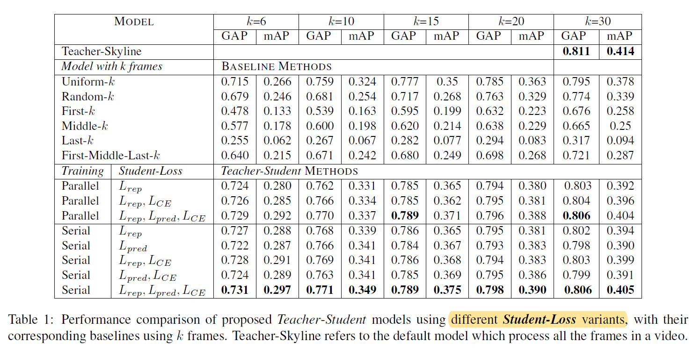
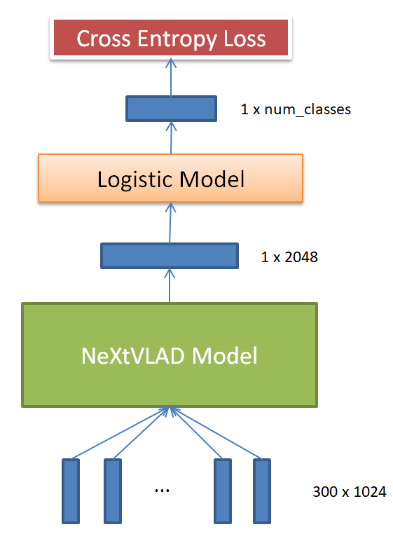
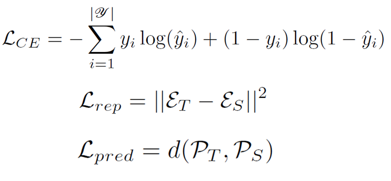
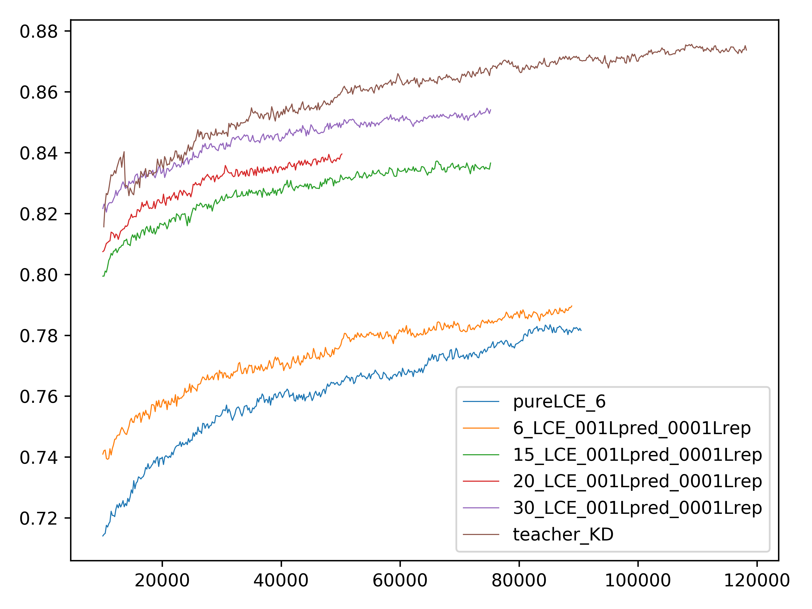

# Video classification with knowledge distillation

Tensorflow implementation of  paper “Efficient Video Classification Using Fewer Frames”.


## Introduction

To begin with, the paper is based on a kaggle competition [2nd Youtube8M Video Understanding Challenge on Kaggle](https://www.kaggle.com/c/youtube8m-2018). It is a video classification task  over the [YouTube-8M](https://research.google.com/youtube8m/) dataset, which contains 8 million videos‘ pre-extracted 1024-dim visual features and 128-dim audio features.  There are three baseline methods mentioned in the paper: H-RNN, NetVLAD and NeXtVLAD. 

The paper proposed a method to reduce the computation time for video classification using the idea of distillation. Specifically, they first train a teacher network which computes a representation of the video using all the frames in the video. They then train a student network which only processes k frames of the video. Generally, performance of the student network is much poorer than that of teacher network. However, performance of student can be improved under the help of teacher. 


They use different combinations of loss functions which ensures that

1. the final representation produced by the student is similar as that produced by the teacher. 

2. the output probability distributions produced by the student are similar to those produced by
   the teacher.

Experiments show that the proposed model outperforms the pure student performance and gives a significant reduction in terms of computational time and cost when compared to the teacher. In other words,  the computationally less expensive student network can reduce the computation time
by 30% while giving an approximately similar performance as the teacher network.




However, the authors did not  open their codes. Among the three methods, NeXtVLAD has the best performance. Thus I tried to implement the knowledge distillation method on NeXtVLAD model. 

Github link of NeXtVLAD model: <https://github.com/linrongc/youtube-8m>


## Network

NeXtVLAD network for video classification




## Experiment

### Prerequisites

In order to run this code you will need to install:

1. Ubuntu14
2. Python3.6
3. Tensorflow  1.2


### Required Data

 [YouTube-8M](https://research.google.com/youtube8m/) 

There is no label message in the test set.  So we get validation set as test set.

You can download them with the following linux commands which support breakpoint downloading. You can start with a small part of the dataset. Evaluation indicators GAP and mAP on the 1% validation set is nearly the same as that on the whole validation set.

1. Download 1% of the datasets

```bash
curl data.yt8m.org/download.py | shard=1,100 partition=2/frame/train mirror=asia python3
curl data.yt8m.org/download.py | shard=1,100 partition=2/frame/validate mirror=asia python3
```

2. Download the whole train set and validation set.

```bash
curl data.yt8m.org/download.py | partition=2/frame/train mirror=asia python3
curl data.yt8m.org/download.py | partition=2/frame/validate mirror=asia python3
```


### Usage

```bash
python train.py --feature_names="rgb,audio" --feature_sizes="1024,128" --groups=8 --nextvlad_cluster_size=128 --nextvlad_hidden_size=2048 --expansion=2 --gating_reduction=8 --drop_rate=0.5 --model=NeXtVLADModel --num_readers=8 --learning_rate_decay_examples 2000000  --video_level_classifier_model=LogisticModel --label_loss=CrossEntropyLoss --train_data_pattern=/home/disk3/a_zhongzhanhui/yt8m_dataset/train_all/train*.tfrecord --frame_features=True   --batch_size=80 --base_learning_rate=0.0002  --learning_rate_decay=0.8 --l2_penalty=1e-5 --max_step=700000 --num_gpu=2 --export_model_steps=200 --train_dir=nextvlad_8g_5l2_5drop_128k_2048_2x80_logistic  --visible_gpu="1"  --start_new_model=False --k_frame=30  --model_type=KD
```

- Firstly, train the teacher network by the above command, changing model_type as teacher and k_frame as 300. Then we will get a checkpoint of the teacher model with about GAP=0.87.
- Secondly, train the student network by the above command, changing model_type as teacher and k_frame as 6. Just take the GAP result of student model as a baseline.
- Finally, start knowledge distillation. Build teacher model and student model in the same graph but with different scope name. Rewrite the checkpoint path in the code to load the teacher checkpoint into the student model and begin to train the student model. During the training process, the teacher model is frozen, only providing logit and prediction of the input video. Train the student by combining three loss as mentioned in the paper:



**LCE**: subscript CE stands for cross entropy between the true labels y and predictions ^y.

**Lrep**: the squared error loss between the representation computed by the student network and the
representation computed by the teacher.

**Lpred**: the squared error loss between the probabilities predicted for the m classes by the teacher and the student.

Here is a trick to do the knowledge distillation.

I failed while directly setting 
$$
loss = LCE+Lrep+Lpred
$$
as the paper said but succeeded by setting
$$
loss=LCE+0.01 Lpred + 0.001 Lrep
$$
I found that the loss setting did not work until I assigned weight to Lrep and Lpred by parameter adjusting time after time.

```
Training step: 80000
Loss: 4.71 | rep_Loss: 16141.03 | pred_Loss: 17.72
```

### Result



The blue wavy line indicates the GAP performance of the student model with 6 frames, only training with LCE. And the orange wavy line indicates the GAP performance of the student model with 6 frames, training with knowledge ditillation technology. Significantly, student guided by teacher performs better than student  learning by himself.